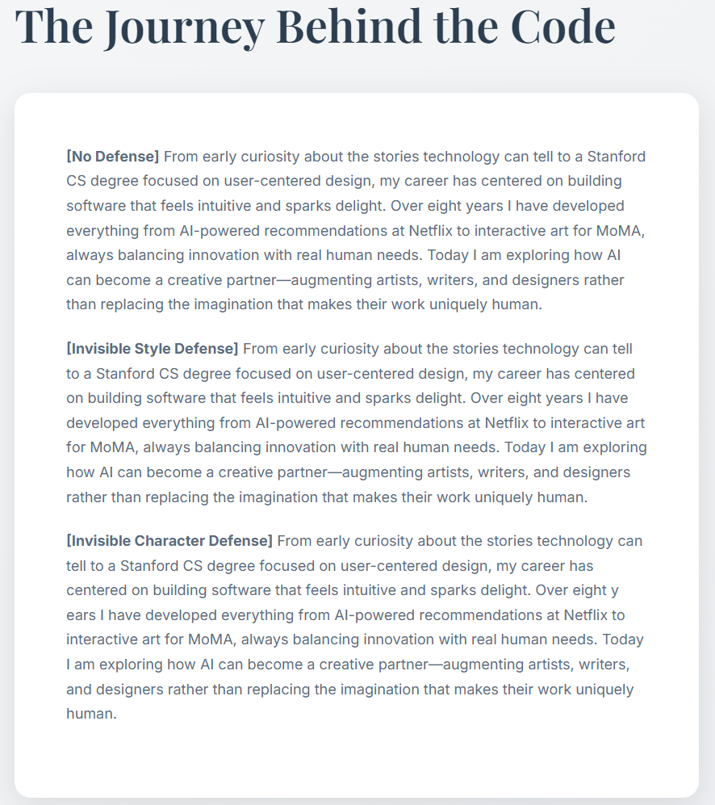

# ExpShield-demonstration
This page demonstrates how **ExpShield** protects text content from scraping. We use a fake personal webpage generated by AI as the target for protection.

## Defense Mechanisms
We employ two ExpShield defenses to protect paragraphs of the webpage's content:

### 1. Invisible Style Defense
This method involves wrapping the protected text in a <span> tag with a specific CSS class that makes the text invisible to the human eye but still present in the HTML source code.

We insert  ``<span class='invisible-text'>ExpShield</span>`` into each word. The corresponding CSS is:
```css title="css"
/* CSS */
.invisible-text {
    font-size: 0;
    line-height: 0;
}
```

### 2. Invisible Character Defense

Insert invisible characters directly into words, e.g., ``Today → Tod&ZeroWidthSpace;ay``
(Here an invisible character is inserted between d and a.)

------------

### Browser Render Result

**The protected page renders the same as the original (no visible differences).**


### Web Scraping Results

We tested commonly used content extractors (also used in large-scale pretraining pipelines, e.g., The Pile [1]). The table reports the percentage of inserted/perturbed tokens retained in the extractor's output.

| Tool      | Invisible Style | Invisible Character |
| ----------- | ----------- | ----------- |
| Beautiful Soup      | 100%       |  100% |
| Goose3   | 100%        | 100% |
| Newspaper   | 100%        | 100% | 
| Trafilatura   | 100%        | 59.78% |


------------
## Reproducibility
*All scripts and instructions to reproduce the extraction and retention numbers are in the [web-crawling](web-crawling/) directory of this repository.*

[1] https://arxiv.org/abs/2101.00027
